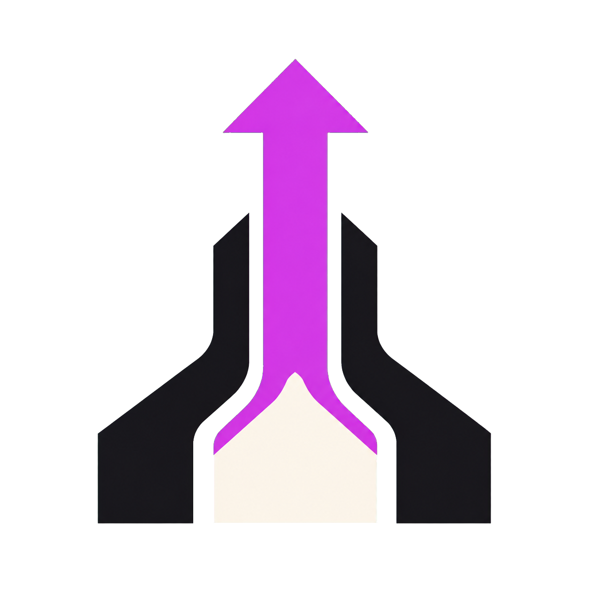
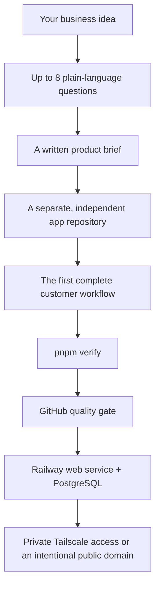
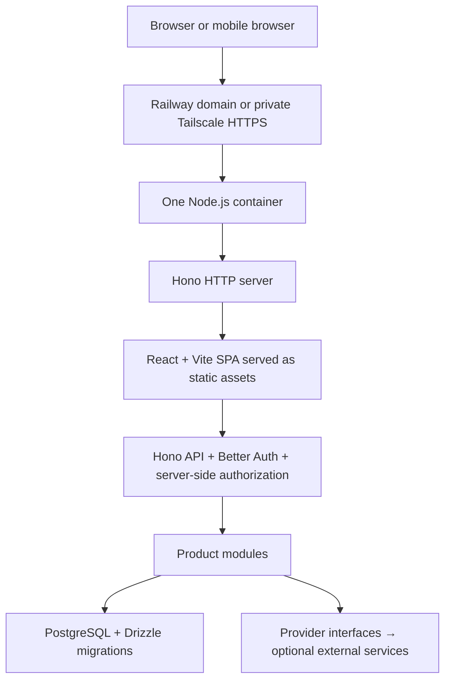

<p align="center">
  
</p>

<h1 align="center">railway-k7cfo-template</h1>

<p align="center"><strong>Start with the business. Inherit the boring parts.</strong></p>

<p align="center">
  An agent-native SaaS launchpad with authentication, PostgreSQL, workspaces,<br>
  support, admin, private networking, quality gates, and one-container deployment already wired.
</p>

<p align="center">
  <a href="https://github.com/k7cfo/railway-k7cfo-template/actions/workflows/template-quality.yml"></a>
  <a href="https://github.com/k7cfo/railway-k7cfo-template/stargazers"></a>
  <a href="https://github.com/k7cfo/railway-k7cfo-template/issues"></a>
  
  
  
</p>

<p align="center">
  <a href="#the-60-second-pitch">Why this exists</a> ·
  <a href="#launch-a-new-idea">Quickstart</a> ·
  <a href="#what-you-inherit">Features</a> ·
  <a href="#one-repo-is-a-feature">Architecture</a> ·
  <a href="#built-for-coding-agents">AI agents</a> ·
  <a href="#deploy-private-or-public">Deploy</a> ·
  <a href="#come-build-with-us">Contribute</a>
</p>

---

> Your launch week should be spent on the thing customers will pay for—not auth callbacks, role checks, schema migrations, Docker layers, and the fifth version of an empty state.

Most SaaS ideas need the same first 80%: identity, durable data, settings, teams, support, safe administration, deployment, and a way to know the build actually works. This repository turns that repeated foundation into a reusable product factory.

Bring an idea. Answer a short interview. Get an independent, tested application that is ready for product work and ready for Railway.

## The 60-second pitch

`railway-k7cfo-template` is two things working together:

1. **A complete SaaS foundation.** The generated app already behaves like a product, not a component gallery.
2. **A contract for coding agents.** Codex and Claude Code are told how to discover the product, where to put features, what must remain secure, and which checks must pass before deployment.

The default architecture is intentionally unsurprising: one TypeScript repository, one Node.js container, one PostgreSQL database, one deployment pipeline. It is easy for a person to reason about and small enough for an agent to hold in context.



### Proven in a real deployment

| Signal | Result |
| --- | --- |
| Observed Railway deploy | **~76 seconds** from source upload to healthy app |
| Runtime shape | **1** application container + **1** PostgreSQL service |
| Product shell | Auth, onboarding, dashboard, settings, support, admin |
| Design systems | Nothing, Apex, and Onyx; light and dark |
| Required quality command | `pnpm verify` |
| Public exposure | Off until you intentionally add a domain |

The deployment time is a measured Hello World result, not a guarantee. Build load, caches, region, and the complexity of your product will change it. The point is what was already working at first health: database migrations, login, onboarding, navigation, saved settings, themes, support tickets, authorization, and SPA routing.

## Launch a new idea

### With Codex or Claude Code — recommended

```bash
git clone https://github.com/k7cfo/railway-k7cfo-template.git
cd railway-k7cfo-template
```

Then give your coding agent this prompt:

```text
Read AGENTS.md before doing anything. I have a new business idea.

Follow the repository's new-product workflow. Ask me one plain-language question at
a time and no more than eight meaningful questions. Do not ask me to choose frameworks
or infrastructure already selected here.

Write the product brief to docs/PRODUCT.md. Generate the app in a separate directory
and Git repository. Preserve the reusable SaaS foundation, adapt the product experience
to my idea, and build the smallest complete customer workflow—no fake buttons or
disconnected screens.

Run pnpm verify plus the Docker and deployment checks. Fix failures before deployment.
If Railway access is available, create a new project in my existing workspace, add
PostgreSQL, deploy, inspect the logs, and smoke test the live app. Do not modify another
Railway project. Keep public networking disabled unless I explicitly request it. Use
Tailscale when I request private access. Never print or commit secrets.
```

The agent handles product discovery and implementation. You make the business decisions.

### By hand

Requirements: Git, [uv](https://docs.astral.sh/uv/), Node.js 24 LTS or later, pnpm through Corepack, and Docker.

```bash
./bin/new-app /absolute/path/to/my-new-business
cd /absolute/path/to/my-new-business
pnpm setup
pnpm dev
```

The wrapper is only a friendly front end for Copier. The direct command is:

```bash
uvx copier copy --trust /absolute/path/to/railway-k7cfo-template /absolute/path/to/my-new-business
```

`pnpm setup` checks the machine, creates safe local configuration without overwriting existing files, starts PostgreSQL, runs migrations, adds development data, and prints the local URL and login.

The generated app has its own Git history, product brief, decision log, agent instructions, owner guide, tests, and deployment documentation. It does not need this template at runtime.

## What you inherit

This is the work that should not consume the first days of every new product.

| Foundation | What is already connected |
| --- | --- |
| **Identity** | Registration, sign-in, sign-out, password reset, sessions, verification hooks, account deletion |
| **People** | Profiles, preferences, personas, notification settings, appearance, security settings |
| **Product activation** | Resumable onboarding with profile, persona, workspace, intent, and first-action steps |
| **Tenancy** | Personal and team workspaces, memberships, invitations, role changes, workspace switching |
| **Authorization** | Server-enforced `owner`, `admin`, `member`, and `support` roles; personas never grant access |
| **Application shell** | Responsive sidebar, mobile navigation, header, breadcrumbs, command menu, user menu |
| **Customer operations** | Searchable FAQs, support tickets, messages, priority, status, close/reopen flows |
| **Internal operations** | Safe user/workspace views, ticket assignment, replies, internal notes, audit events, system status |
| **Commercial plumbing** | Optional billing, entitlement, checkout, portal, subscription, and webhook scaffolding |
| **Provider edges** | Swappable AI, email, object storage, jobs, analytics, and billing interfaces |
| **Reliability** | Loading, empty, error, success, unavailable, and unconfigured states; health and readiness endpoints |
| **Operations** | Committed migrations, seed policy, Docker, Railway config, secrets guidance, launch checklist |

Optional services are honest. With no AI key, email provider, bucket, or Stripe account, the app still boots and explains what is unconfigured. It never pretends an integration succeeded.

## One repo is a feature

The modular monolith is not a compromise waiting to be replaced. It is the fastest useful shape for an early product.

### One customer action, one place to trace it

A settings update can move from React to Hono to a transaction in PostgreSQL without crossing repositories, queues, gateways, generated clients, or distributed traces. That makes debugging faster for humans and dramatically reduces the context an agent must reconstruct.

### One deployable artifact

Vite compiles the React SPA. Hono serves the API, Better Auth, static assets, and SPA fallback. The production Docker image contains one non-root Node.js process. The same image runs on Railway or another container host.

### Modules where they help; networks only where they matter

Product features remain cohesive modules. External providers sit behind small interfaces. PostgreSQL owns durable state. A separate network edge exists only when Tailscale is enabled. We do not pay the coordination cost of microservices before the product has a reason to need them.



The diagram stays top-to-bottom because there is one request path to understand and one release to operate. React never connects to PostgreSQL or provider SDKs; data access, authorization, and provider selection remain server-side.

### What is deliberately absent

No microservices. No Kubernetes. No Redis requirement. No Kafka. No GraphQL. No tRPC. No Next.js. No Terraform. No second database. No separate frontend deployment. No custom application framework.

Those tools can be excellent when a product earns their complexity. They are poor entrance fees for testing an idea.

## The stack, chosen on purpose

<p align="center">
  
  
  
  
  
</p>

<p align="center">
  
  
  
  
  
</p>

| Choice | Why it is here |
| --- | --- |
| **TypeScript + Node.js LTS** | One language across browser, server, scripts, migrations, and tests; strong editor and agent feedback |
| **Hono** | Small, fast, web-standard HTTP primitives without inventing an application framework |
| **React + Vite + React Router** | Familiar component model, excellent development loop, and a portable static production build |
| **TanStack Query + Zod** | Explicit server-state behavior and validation at trust boundaries |
| **PostgreSQL + Drizzle** | Durable relational data, transactions, constraints, and migrations that remain visible in the repository |
| **Better Auth** | Authentication lifecycle and sessions without mixing product profile data into auth records |
| **Tailwind + shadcn + Radix** | Accessible primitives with three distinctive design systems instead of stock demo screens |
| **Biome + TypeScript + Knip** | Fast formatting/linting, strict types, and pressure against dead or duplicated code |
| **Vitest + Playwright** | Fast domain/API feedback plus proof that complete desktop and mobile workflows work |
| **Docker + Railway** | The frontend and API ship together as one repeatable artifact; Railway is the first target, not a code dependency |
| **Tailscale** | Private HTTPS testing without making an unfinished product public or treating network identity as application identity |

## Quality is part of the product

AI can produce code quickly. Speed without a definition of done produces a larger debugging bill.

Every generated application has one required pre-deployment gate:

```bash
pnpm verify
```

It verifies:

- formatting and Biome lint rules;
- strict server and client TypeScript;
- Vitest unit and API behavior;
- dead files, dependencies, and duplicate packages with Knip;
- the production server and React build;
- the JavaScript bundle budget;
- desktop and mobile Playwright workflows;
- authentication, onboarding, settings, support, admin denial, and sign-out;
- production `/health`, database-backed `/ready`, and SPA fallback; and
- deployment structure and tracked-secret safety.

GitHub Actions generates a completely clean app, starts PostgreSQL, migrates and seeds it, repeats the product workflows, checks the compiled server, and builds the production container. Railway's **Wait for CI** setting can keep a failed revision out of deployment.

The rules are intentionally opinionated: fix failures; do not weaken the rule until the red mark disappears.

## Deploy private or public

### Private is the default

Deploying the app to Railway does not automatically create an inbound public URL. The web service and PostgreSQL can communicate over Railway's private network, while the unfinished product remains unreachable from the public internet.

Tailscale support is included for private testing:

- locally, `pnpm dev:tailscale` exposes the normal development app through private Tailscale HTTPS;
- on Railway, the optional `ops/tailscale-proxy` service forwards Tailscale Serve to the web service's private hostname;
- your Tailscale credential stays in the edge proxy, never in React or product code; and
- `pnpm tailscale:check` verifies health, readiness, anonymous auth protection, and SPA fallback through the tailnet.

No node silently joins a tailnet. No auth key is bundled. Better Auth and server-side roles remain authoritative even on the private route.

### Public when you are ready

Generate a domain in the Railway web service's Networking settings—or ask your agent to do it—then set `APP_URL` and `BETTER_AUTH_URL` to that exact HTTPS origin and redeploy. Add a custom domain later without changing application architecture.

### Railway first, not Railway locked

Application modules do not import Railway bindings. The same Docker image can run on Google Cloud Run, AWS container services, Azure Container Apps, Fly.io, Render, or a generic Docker host with `PORT`, PostgreSQL, URLs, and secrets configured.

Read the generated guides for exact operations:

- [Deploy to Railway](template/docs/RAILWAY.md)
- [Private access with Tailscale](template/docs/TAILSCALE.md)
- [Publish a Railway one-click template](template/docs/PUBLISH_AS_RAILWAY_TEMPLATE.md)
- [Manage secrets with 1Password and Railway Variables](template/docs/SECRETS.md)

## Built for coding agents

The repository does not rely on a clever prompt hidden in this README.

- `AGENTS.md` is the canonical contract for Codex and other coding harnesses.
- `CLAUDE.md` is a relative symlink to the same contract for Claude Code.
- `docs/PRODUCT.md` records whom the product serves and what success means.
- `docs/DECISIONS.md` records assumptions and non-obvious tradeoffs.
- Typed navigation centralizes roles, personas, features, workspace state, and device visibility.
- Provider SDKs stay behind `src/services/*`; React and product modules do not import them.
- Every workspace operation verifies membership on the server.
- Every schema change includes a committed migration.
- Complete workflows, mobile behavior, accessibility, failure states, tests, and docs are part of “done.”

The instructions tell an agent what not to invent, too: no fake buttons, fake connected integrations, speculative services, browser-only authorization, secret-bearing `VITE_*` variables, or abstraction with one imaginary consumer.

Humans get a maintainable product. Agents get explicit boundaries. Both get the same source of truth.

## Design that does not look generated

Choose a visual system during generation:

| System | Character |
| --- | --- |
| **Nothing** | Monochrome instrument panel, precise typography, signal-red accents |
| **Apex** | Warm industrial paper, editorial type, vermilion energy |
| **Onyx** | Polished obsidian surfaces, controlled depth, sapphire highlights |

All three retain light and dark modes, semantic tokens, responsive behavior, motion, shadcn/Radix foundations, and keyboard-accessible primitives. The selected system sets the opening character without locking future product work into a generic theme.

## Make it yours

Copier asks only product-level starter questions:

- project name, title, promise, and description;
- visual system;
- whether team, support, admin, billing, AI, email, and storage surfaces are visible; and
- the default AI provider.

The ownership model, server authorization, provider boundaries, migrations, and deployment shape remain intact even when a surface is hidden. That lets an initially single-user product grow collaboration later without a tenancy rewrite.

## Come build with us

This is an opinionated foundation, not a finished answer to every product. Contributions that make the default path faster, clearer, safer, more accessible, or easier to operate are welcome.

Good places to help:

- complete provider adapters that preserve the existing boundaries;
- accessibility and mobile refinements across all three design systems;
- sharper smoke tests and clearer failure messages;
- Railway, Tailscale, Docker, and cloud-portability documentation;
- smaller bundles and simpler modules without removing useful SaaS capabilities; and
- real product-shell improvements—not decorative demo components.

Before opening a pull request:

1. Read [`AGENTS.md`](AGENTS.md) and the affected generated documentation.
2. Change the Copier source under `template/`, not a generated smoke app.
3. Generate a clean disposable application.
4. Run its migrations, seed, `pnpm verify`, and Docker checks.
5. Explain the user impact and any assumption you introduced.

Browse [open issues](https://github.com/k7cfo/railway-k7cfo-template/issues), propose a focused improvement, or open a small pull request. If the project saves you a launch day, a star helps other builders find it.

## Maintainer workflow

The renderable project is under `template/`. Files ending in `.jinja` are rendered by Copier; other files are copied verbatim.

Generate a disposable app before committing template changes:

```bash
uvx copier copy --trust --defaults --data project_slug=smoke-test . /tmp/smoke-test
```

Never commit a generated smoke app, real environment file, API token, Tailscale key, private key, or provider credential.

## Frequently asked questions

<details>
<summary><strong>Is this another application framework?</strong></summary>

No. It composes established tools with a clear project structure and operating contract. Product code is ordinary Hono, React, PostgreSQL, and TypeScript.
</details>

<details>
<summary><strong>Why Copier instead of GitHub's “Use this template” button?</strong></summary>

Copier can ask a small set of product questions, render honest feature visibility, preserve answers for future updates, create marker files and agent instructions, and run safe post-generation setup.
</details>

<details>
<summary><strong>Do I need Railway?</strong></summary>

No. Railway is the fastest documented path. The application is a normal Dockerized Node.js service using PostgreSQL and environment variables.
</details>

<details>
<summary><strong>Do I need Tailscale?</strong></summary>

No. Tailscale is an optional private edge. Leave it out and use a Railway or custom HTTPS domain when the product should be public.
</details>

<details>
<summary><strong>Can I split it into services later?</strong></summary>

Yes. Start with the operationally simple shape. Extract a boundary when real scaling, security, ownership, or deployment evidence justifies the cost.
</details>

<details>
<summary><strong>Does the template seed production?</strong></summary>

Never automatically. Development seed commands are explicit, and `db:reset` refuses to run in production.
</details>

## Provenance

The visual foundation derives from [knowsuchagency/cloudflare-template](https://github.com/knowsuchagency/cloudflare-template). Its Nothing, Apex, and Onyx systems, typography, shadcn/Radix foundations, visual character, and existing upstream notices are retained. See [`docs/UPSTREAM.md`](template/docs/UPSTREAM.md).

---

<p align="center">
  <strong>Build the part only your business can build.</strong><br>
  Let the template carry the rest.
</p>
