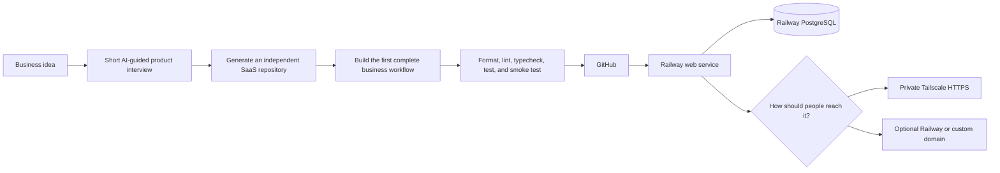

# railway-k7cfo-template

**Turn a business idea into a tested SaaS product without rebuilding authentication, databases, settings, or deployment plumbing.**

[](https://github.com/k7cfo/railway-k7cfo-template/actions/workflows/template-quality.yml)

`railway-k7cfo-template` is a Railway-first, cloud-portable SaaS factory. Tell Codex or Claude Code what you want the business to help someone accomplish, answer a short product interview, and let the agent generate a separate application with the foundation already in place.

The result is not a collection of disconnected UI examples. It is a working product shell with registration, onboarding, workspaces, authorization, settings, support, administration, PostgreSQL, Docker, private networking, and deployment checks already connected.

That means you can focus on the workflow that makes your idea valuable instead of spending the first hours or days rebuilding the same base technology.

## From idea to a running product



Each generated product normally stays deliberately simple:

- one Git repository;
- one Node.js application container serving the Hono API and React SPA;
- one Railway web service;
- one Railway PostgreSQL service;
- one deployment pipeline; and
- one private Tailscale edge service only when tailnet access is enabled on Railway.

No microservices, Kubernetes, Redis, Kafka, separate frontend deployment, or custom framework are introduced by default.

## How fast is it?

In our clean Railway smoke test, a configured Hello World SaaS deployment reached a healthy, database-backed state about **76 seconds after source upload began**. Railway build load, dependency caches, region, and application complexity can change that time, so this is a measured result rather than a guarantee.

The important part is what was already working when it came online: authentication, onboarding, dashboard navigation, saved settings, themes, support tickets, authorization, health checks, database migrations, and SPA routing. A simple idea can be testable in minutes; a more involved product can still save hours or days of foundation work.

## What every generated application includes

### Product foundation

- Registration, sign-in, sign-out, password reset, sessions, and account deletion with Better Auth
- User profiles, preferences, personas, and resumable onboarding
- Personal and team workspaces, invitations, memberships, and workspace switching
- Server-enforced `owner`, `admin`, `member`, and `support` roles
- Responsive desktop and mobile navigation with breadcrumbs, search, and workspace controls
- Profile, account, security, notification, appearance, workspace, member, integration, billing, and data settings
- Customer support tickets, replies, status changes, FAQs, and internal support notes
- Safe administrative views for users, workspaces, support, audit events, and system configuration
- Honest loading, empty, error, success, unconfigured, and unavailable states

### Technology foundation

- TypeScript, Node.js LTS, pnpm, Hono, React, Vite, and React Router
- TanStack Query, Zod, Tailwind CSS, shadcn, and Radix UI
- PostgreSQL with Drizzle ORM and committed migrations
- Better Auth with product profiles kept separate from authentication records
- Nothing, Apex, and Onyx design systems with light and dark themes
- Provider boundaries for AI, email, storage, jobs, analytics, and optional Stripe billing
- Multistage, non-root Docker image serving the API and compiled React app together
- Railway configuration with pre-deploy migrations, `/health`, `/ready`, and graceful shutdown
- Portable application code suitable for other container platforms

### Protection against AI slop

Generated apps have one required gate:

```bash
pnpm verify
```

It runs formatting checks, Biome linting, strict TypeScript checks, Vitest, dead-code detection, a production build, a bundle budget, Playwright browser flows, production-server smoke tests, and deployment-structure checks. GitHub Actions repeats the important PostgreSQL, browser, production, and Docker checks; Railway's **Wait for CI** setting can then prevent a failed revision from deploying.

The agent instructions explicitly require small changes, complete workflows, real authorization, database migrations, useful states, updated documentation, and tests. Fake buttons, fake integrations, ignored type failures, and unnecessary abstraction layers are not considered complete.

## Start with an AI coding agent

Give the following prompt to Codex, Claude Code, or another repository-aware coding agent:

```text
Clone https://github.com/k7cfo/railway-k7cfo-template and read AGENTS.md before doing anything.

I have a new business idea. Follow the repository's new-product workflow. Ask me one
plain-language question at a time, using no more than eight meaningful questions. Do
not ask me to choose frameworks or infrastructure already selected by the template.

Write the resulting product brief to docs/PRODUCT.md and generate the application in
a separate directory and Git repository. Preserve the reusable SaaS foundation, then
adapt the onboarding, personas, navigation, dashboard, data model, permissions, and
terminology to my idea. Build the smallest complete customer workflow; do not leave
fake buttons or disconnected screens.

Run pnpm verify and the Docker/deployment checks. Fix every failure before recommending
deployment. If Railway access is available, create a new project in my existing Railway
workspace with one web service and PostgreSQL, deploy it, inspect the logs, and smoke
test the live application. Do not modify an existing Railway project. Keep public
networking disabled unless I explicitly ask for a public domain. Configure and test
Tailscale when I request private access. Never print or commit secrets.
```

`AGENTS.md` is canonical for Codex. `CLAUDE.md` is a relative symlink to the same file, so Claude Code receives the same architecture, security, product-discovery, testing, and definition-of-done instructions.

## Generate an application manually

Requirements: Git, [uv](https://docs.astral.sh/uv/), Node.js 24 LTS or later, pnpm through Corepack, and Docker.

```bash
git clone https://github.com/k7cfo/railway-k7cfo-template.git
cd railway-k7cfo-template
./bin/new-app /absolute/path/to/my-new-business
```

The wrapper only simplifies Copier. You can invoke Copier directly instead:

```bash
uvx copier copy --trust /absolute/path/to/railway-k7cfo-template /absolute/path/to/my-new-business
```

Then:

```bash
cd /absolute/path/to/my-new-business
pnpm setup
pnpm dev
```

`pnpm setup` checks the local tools, creates safe configuration without overwriting existing environment files, starts PostgreSQL, applies migrations, adds development data, and prints the local address and development login.

The generated application is independent of this repository at runtime. It keeps its Copier answers, creates its own local Git history, and includes its own `AGENTS.md`, product brief, owner guide, deployment guide, and decision log.

## Private by default

Deploying the application service to Railway does **not** automatically create a public IP address or public URL. The container can communicate with PostgreSQL and other project services over Railway's private network, but internet traffic cannot reach it until you intentionally enable public networking.

You have two straightforward choices:

1. **Private Tailscale access:** use the included Tailscale tooling locally or add the included `ops/tailscale-proxy` service on Railway. Provide your own Tailscale auth credential, keep the Railway services without public domains, and test through the resulting private `https://…ts.net` address.
2. **Public launch:** generate a Railway domain from the web service's Networking settings—or ask your coding agent to do it—then set `APP_URL` and `BETTER_AUTH_URL` to that exact HTTPS origin and redeploy. A custom domain can replace it later.

Tailscale support is built in, but no device is silently joined to a tailnet and no credential is bundled. The Tailscale auth key remains isolated in the optional proxy instead of being exposed to the application. Better Auth and server-side workspace authorization still protect the product even on the private network.

See [the Tailscale guide](template/docs/TAILSCALE.md) and [the Railway guide](template/docs/RAILWAY.md) for the exact commands and variables.

## Deploy to Railway

After the product-specific workflow is complete:

```bash
pnpm verify
pnpm deploy:check
```

Push the generated application to its own GitHub repository, create a new Railway project, add PostgreSQL, and set the web service's database reference:

```text
DATABASE_URL=${{Postgres.DATABASE_URL}}
```

Generate a new `BETTER_AUTH_SECRET` in Railway. Do not copy development credentials or reuse another product's secret. Railway builds the supplied Dockerfile, runs committed migrations before deployment, and checks `/health`. Enable **Wait for CI** so a failed GitHub quality workflow prevents a bad revision from reaching Railway.

For a one-click distribution of a finished product, convert its stabilized Railway project into a Railway template. The Copier repository is the product factory; the Railway template should point to a generated, deployable application repository. See [Publish as a Railway one-click template](template/docs/PUBLISH_AS_RAILWAY_TEMPLATE.md).

## Why this architecture

Most early SaaS products do not need an infrastructure department. A modular monolith keeps the frontend, API, authentication, and product code in one place, so a person or coding agent can trace a workflow without crossing services or repositories. PostgreSQL provides durable state and transactions. Docker makes the same build runnable beyond Railway. Small provider interfaces keep external AI, email, billing, and storage vendors replaceable without spreading their SDKs through the product.

This foundation is intentionally substantial where every SaaS needs reliability—authentication, authorization, migrations, secrets, testing, and deployment—and intentionally light where the business idea should make the decisions.

## Develop the template

The renderable project is in `template/`. Files ending in `.jinja` are rendered by Copier; other files are copied as-is. Generate a disposable application before committing template changes:

```bash
uvx copier copy --trust --defaults --data project_slug=smoke-test . /tmp/smoke-test
```

Read the root `AGENTS.md` before modifying the factory. Never commit a generated smoke application, real environment file, API token, Tailscale key, or provider credential.

## Provenance

This project was derived from [knowsuchagency/cloudflare-template](https://github.com/knowsuchagency/cloudflare-template). Its Nothing, Apex, and Onyx design systems, shadcn/Radix components, typography, visual character, and existing upstream notices are retained. See [`docs/UPSTREAM.md`](template/docs/UPSTREAM.md) for provenance.
